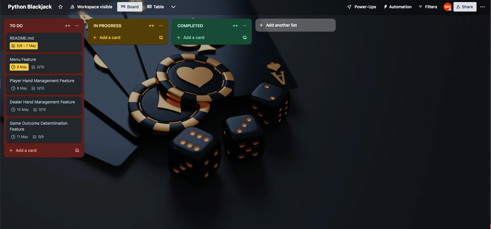
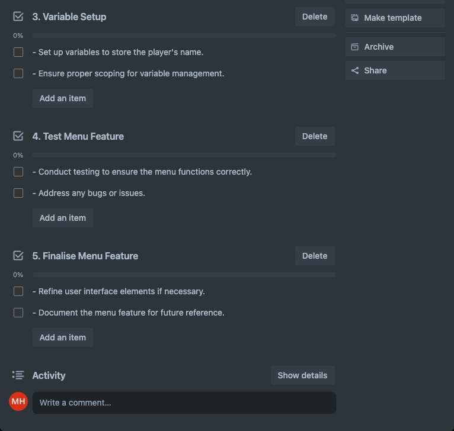
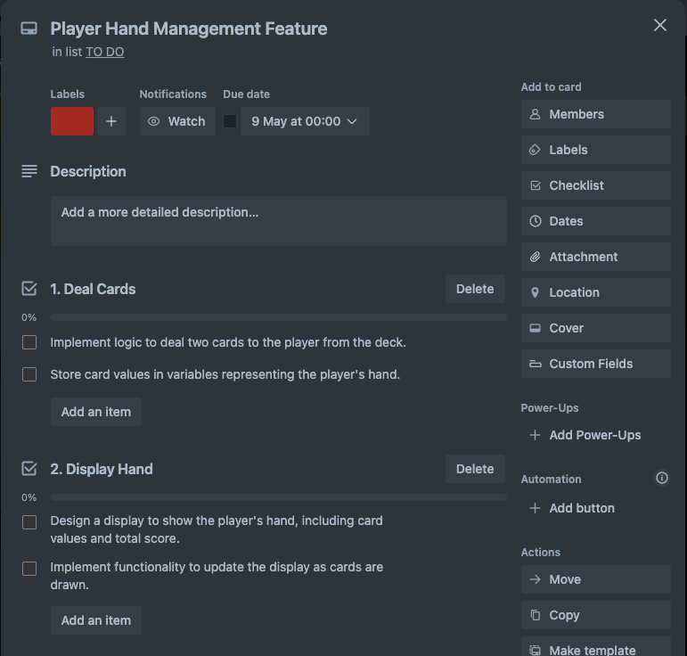
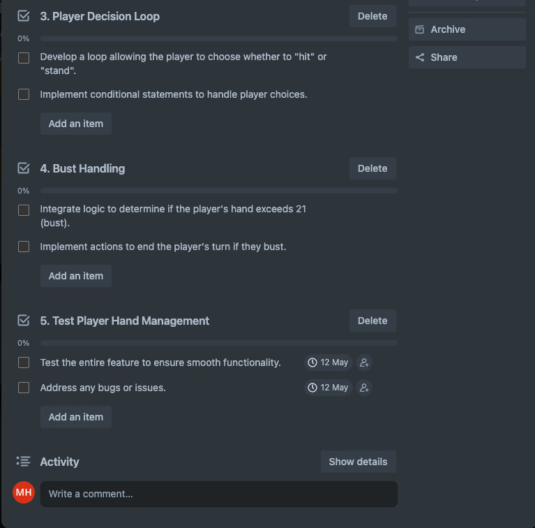
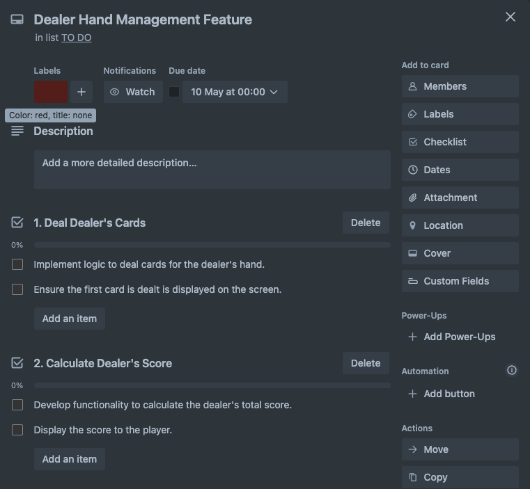
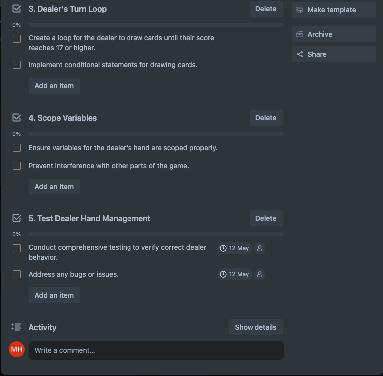
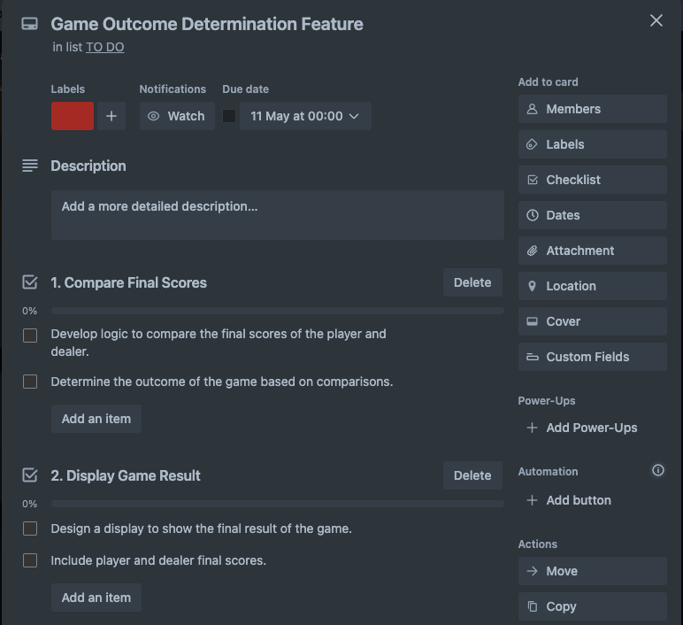
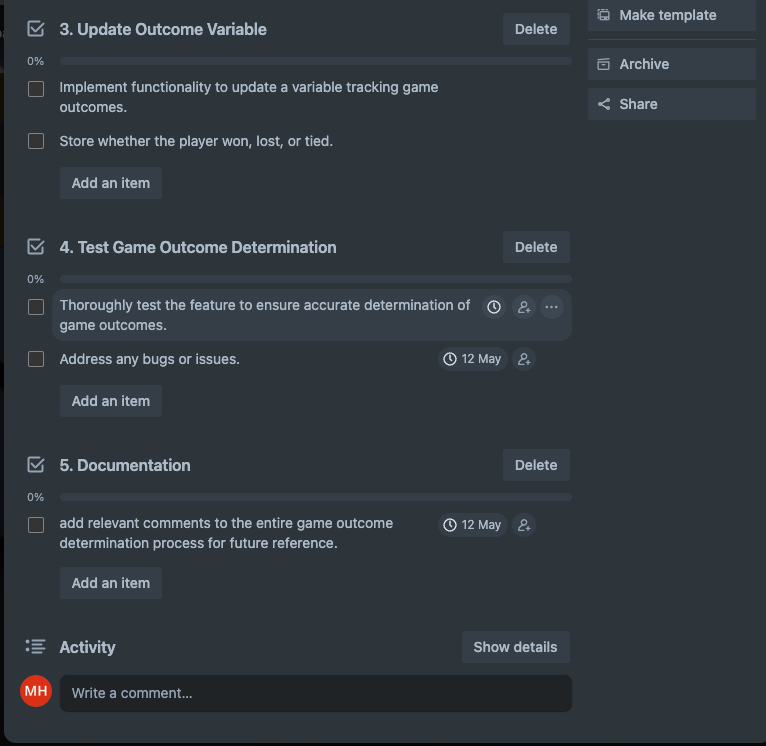
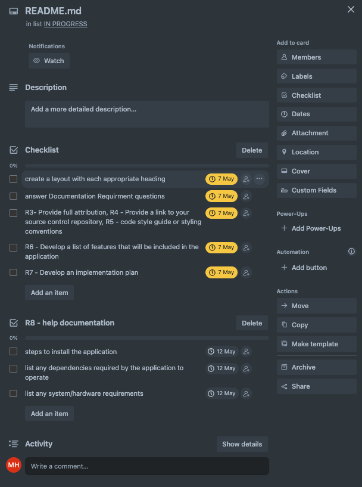
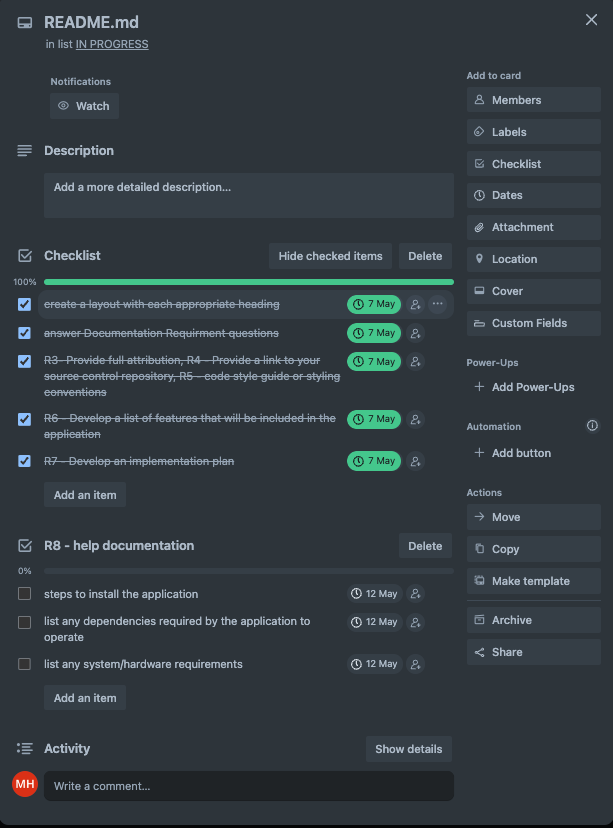

# T1A3: Terminal Application - Python Blackjack

GitHub Repository Link: [Click Here!](https://github.com/motech99/T1A3_Terminal_App)

## Table of Content

- [Descripton](#descripton)
- [Features](#features)
- [Implementation Plan](#implementation-plan)
- [Help Documentation](#help-documentation)
- [References](#references)

## Descripton

Welcome to my terminal application, Blackjack Python Edition, created as part of my final assessment for Term 1 at Coder Academy. Blackjack is a card game in which the objective is to get cards that add up to 21 without going over. You will compete against the dealer. The winner is whoever gets closest to 21 without exceeding it. However, if you go over 21, you lose the round. The game requires a combination of luck and strategy as you decide whether to take another card or stick with what you have.

### Code Style Guide

This code follows PEP 8 style convention which can be found here: [PEP 8 – Style Guide for Python Code](https://peps.python.org/pep-0008/)

## Features

### Menu Feature

- Upon starting the application, a small menu titled "Blackjack" will greet the player.

- The game's menu will require the player to enter their name before they can start playing.

- This feature utilises variables to store the player's name.

- It includes simple error handling to ensure the player enters their name correctly.

### Player Hand Management Feature

- When the game starts, this feature deals two cards to the player from a standard 52-card deck.

- It stores the values of these cards in a variable representing the player's hand.
The player's hand, including the values of the cards and the total score, is displayed to the player.

- The feature includes a loop that allows the player to choose whether to "hit" (draw another card) or "stand" (keep their current hand).

- Conditional control structures are used to determine if the player's hand exceeds 21 (bust) or if the player decides to stand.

- Variables are scoped to manage the player's hand separately from other game parts.

### Dealer Hand Management Feature

- After the player finishes their turn, this feature deals the dealer's cards.

- The first card is dealt face-up, and the second card is also dealt face-up.

- It then calculates the dealer's total score and displays it to the player.

- Using a loop and conditional control structures, the dealer draws cards until their hand reaches a score of 17 or higher.

- Variables are scoped to ensure the dealer's hand is managed separately from the player's hand.

### Game Outcome Determination Feature

- Once both the player and dealer have completed their turns, this feature determines the outcome of the game.

- It compares the final scores of the player and dealer using conditional statements.

- If the player has a score higher than the dealer's, and it does not exceed 21, the player wins. If the dealer's score is higher and does not exceed 21, the dealer wins.

- If both exceed 21, it's a bust, resulting in a tie. If the final scores are equal, it's also a tie.

- The feature displays the final result of the game, including the player's and dealer's final scores and the outcome (player win, dealer win, or tie).

- Additionally, it updates a variable to track the outcome of each game, storing whether the player won, lost, or tied.

## Implementation Plan

### [Link to Trello Board](https://trello.com/b/DHZMC0Ul/python-blackjack)

I have opted to use Trello because I have used it before on previous projects, and find it user-friendly.

All features are listed by priority with estimated due dates. The Menu feature is first, and the Game Outcome Determination feature is last.

Each feature has been allocated a one-day time frame for completion, which is subject to change if any feature takes longer to develop. You can view the complete plan on the Trello Board linked above or review the progression screenshots below.

### Features priority in order

### Progression as of 07/05/2024

## Help Documentation

placeholder

### How to install

placeholder
placeholder
placeholder

### Dependencies Required

### System/Hardware Requirements

placeholder
placeholder

## References

Bicycle Cards ***(n.d)*** LEARN TO PLAY Blackjack, Bicycle Cards
Available at: [https://bicyclecards.com/how-to-play/blackjack/](https://bicyclecards.com/how-to-play/blackjack/)
