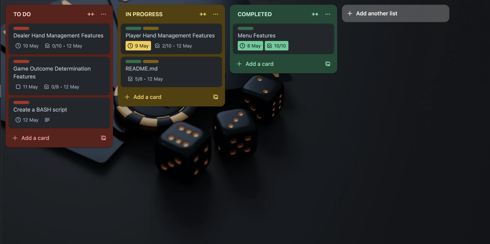
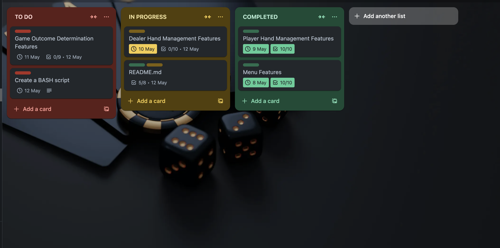
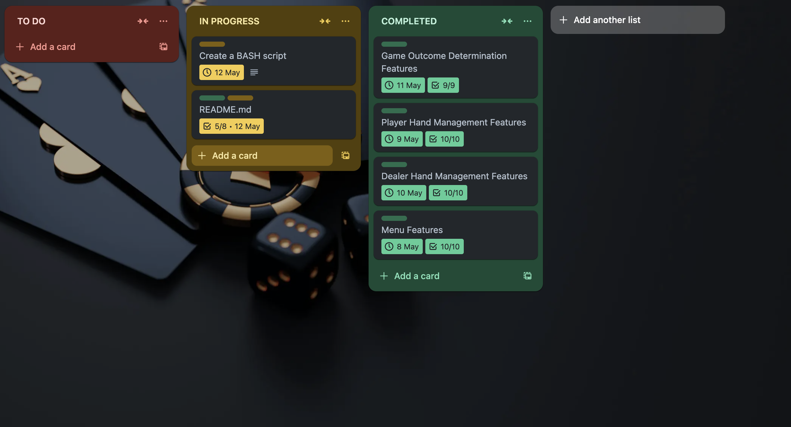
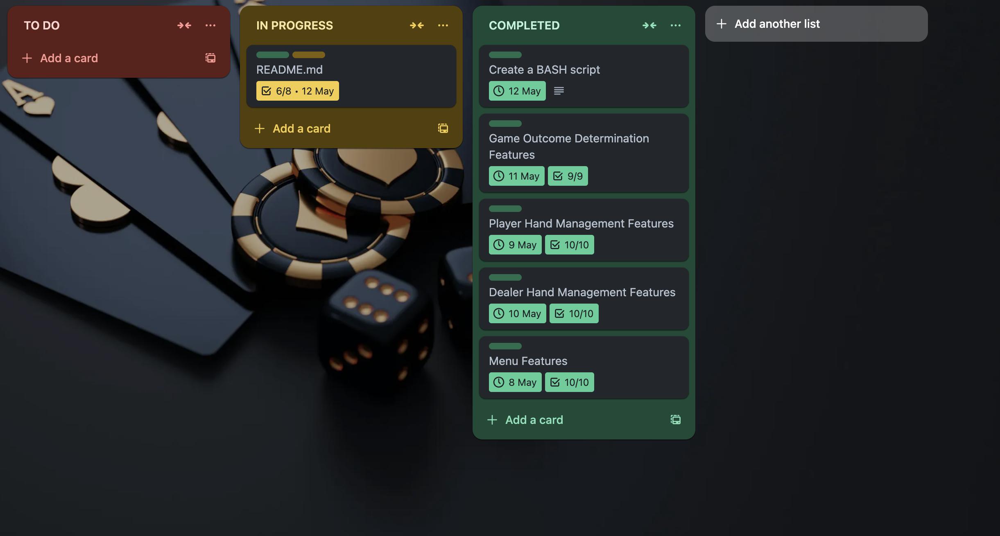
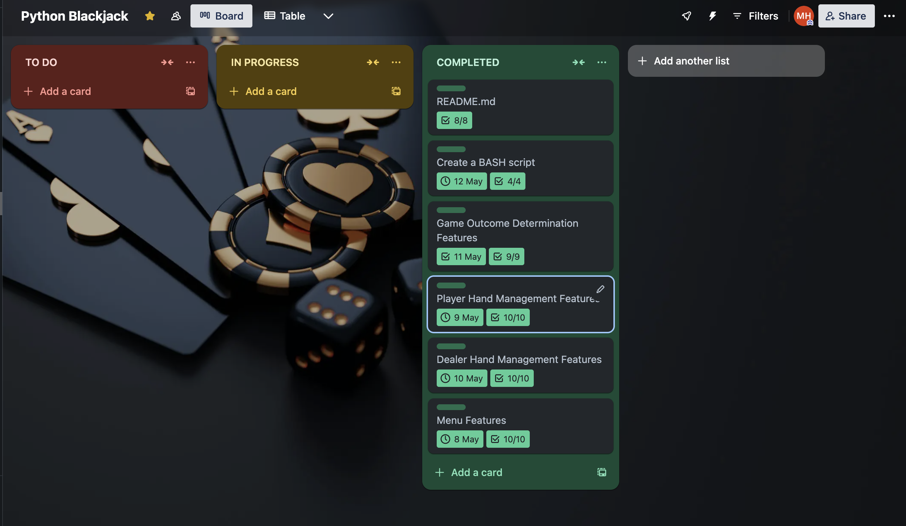

# T1A3: Terminal Application - Python Blackjack

GitHub Repository Link: [Click Here!](https://github.com/motech99/T1A3_Terminal_App)

## Table of Content

- [Descripton](#descripton)
- [Features](#features)
- [Implementation Plan](#implementation-plan)
- [Help Documentation](#help-documentation)
- [References](#references)

## Descripton

Welcome to my terminal application, Blackjack Python Edition, created as part of my final assessment for Term 1 at Coder Academy. Blackjack is a card game in which the objective is to get cards that add up to 21 without going over. You will compete against the dealer. The winner is whoever gets closest to 21 without exceeding it. However, if you go over 21, you lose the round. The game requires a combination of luck and strategy as you decide whether to take another card or stick with what you have.

### Code Style Guide

This code follows PEP 8 style convention which can be found here: [PEP 8 – Style Guide for Python Code](https://peps.python.org/pep-0008/)

## Features

### Menu

- Upon starting the application, a small menu titled "Blackjack" will greet the player.

- The game's menu will require the player to enter their name before they can start playing.

- This feature utilises variables to store the player's name.

- The game has a basic error-handling feature that prompts the player to enter their name correctly before the game begins. The name field cannot be left empty or contain numerical values. It should only include alphabetic characters and spaces to allow for the use of the player's full name if they wish.

### Player Hand Management

- When the game starts, this feature deals two cards to the player from a standard 52-card deck the same rule applies to the dealer as well.

- It stores the values of these cards by utilising the print_hand function representing the player's hand.

- The player's starting hand is displayed, showing each card as ASCII art followed by the total score. The score utilises the calculate total function to keep track of it and is displayed to the player along with the dealer's starting hand and points.

- This feature includes a loop that allows the player to choose whether to "hit" (draw another card) or "stand" (not draw a card) which then will be the dealer's turn.

- Conditional control structures are used to determine if the player's hand exceeds 21 (bust) or if the player decides to stand.

### Dealer Hand Management

- After the player finishes their turn, a while loop runs by utilising the calculate_total function to see the current score, this checks if the score is currently lower than 17.

- The function "print_hand" is being used again to show the dealer's card.

- It then calculates the dealer's total score and displays it on the screen.

- Then the dealer draws cards until any of the winning conditions are met. (this is from the game Outcome determination feature.)

- Variables are scoped to ensure the dealer's hand is managed separately from the player's hand.

### Game Outcome Determination

- After the player and dealer have both taken their turns, this feature determines the outcome of the game.

- It compares the final scores of the player and dealer using conditional statements.

- If a player has a higher score than the dealer in a game of Blackjack, and that score does not exceed 21, the player wins. On the other hand, if the dealer's score is higher than the player's and does not exceed 21, the dealer wins. This rule also applies when the player chooses to 'hit' or 'stand'. If either the player or the dealer hits 21, it's known as a blackjack and it results in an automatic win.

- If the final scores are equal, it's also a tie.

- The feature displays the final result of the game, including the player's and dealer's final scores and with an appropriate message (player win, dealer win, or tie).

- A class is used to keep track of the score, whether it's a win, a loss, or a tie. This score is displayed at the start of each game. If the player decides to continue playing, the score will be displayed again at the start of the game to keep track of the wins and losses. If the player decides not to play anymore, the final scores will be displayed along with a thank you message.

## Implementation Plan

### [Link to Trello Board](https://trello.com/b/DHZMC0Ul/python-blackjack)


I have opted to use Trello because I have used it before on previous projects, and find it user-friendly.

All features are listed by priority with estimated due dates. The Menu feature is first, and the Game Outcome Determination feature is last.

Each feature has been allocated a one-day time frame for completion, which is subject to change if any feature takes longer to develop. You can view the complete plan on the Trello Board linked above or review the progression screenshots below.

### Features priority in order


### Progression as of 07/05/2024


### Progression as of 08/05/2024



### Progression as of 09/05/2024



### Progression as of 10/05/2024



### Progression as of 12/05/2024





## Help Documentation

Here are the instructions to install and run the application smoothly.

### How to install

You can install the application by following these steps:

#### 1. Clone this repository to your local machine

- To clone the repository:

```bash
git clone https://github.com/motech99/T1A3_Terminal_App.git
```

OR

#### 1. Download the ZIP file

- Click the green "Code" button and select "Download ZIP". Extract the downloaded ZIP file to your desired location.

#### 2. Navigate to the directory

- To navigate to the directory, locate the file location and run the following command:

```bash
cd T1A3_Terminal_App
```

#### 3. Make the installation script executable

```bash
chmod +x blackjack_app.sh
```

### 4. Run the installation script to set up the application and its dependencies

```bash
./blackjack_app.sh --install
```

This script creates a virtual environment, installs dependencies, and checks for python and python3 and pip if they are both installed.

### Dependencies Required

This application requires the following dependencies to be installed:

```py
iniconfig==2.0.0
markdown-it-py==3.0.0
mdurl==0.1.2
packaging==24.0
playingcards.py==1.1.1
pluggy==1.5.0
pyfiglet==1.0.2
Pygments==2.18.0
pytest==8.2.0
rich==13.7.1
```

Ensure Python and Pip are installed on your system before proceeding with the installation.

### System/Hardware Requirements

The Blackjack application is compatible with Python on most systems. Below are the general system and hardware requirements:

- **Operating System:** Windows 10 and above or MacOS or Linux

- **Hardware:** Standard hardware requirements for running Python applications

## Sources

Bicycle Cards ***(n.d)*** LEARN TO PLAY Blackjack, Bicycle Cards
Available at: [https://bicyclecards.com/how-to-play/blackjack/](https://bicyclecards.com/how-to-play/blackjack/)

### Acknoledgements

This application heavily utilises playingcards.py, an advanced Python module that simplifies card game creation. Learn more about the library here: [Python Playing Card Module](https://github.com/blakepotvin/playingcards.py)